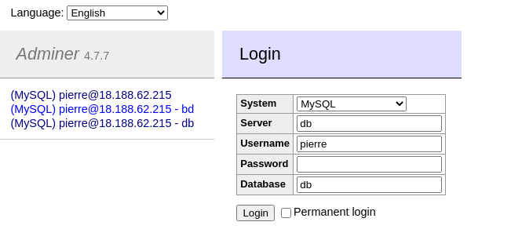
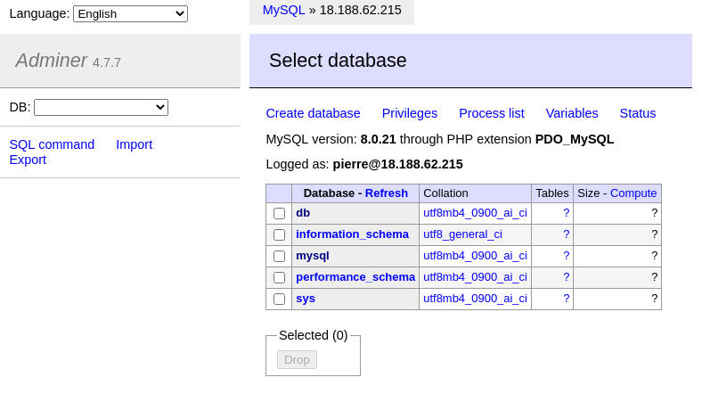

# Credentials Folder

## The purpose of this folder is to store all credentials needed to log into your server and databases. This is important for many reasons. But the two most important reasons is
    1. Grading , servers and databases will be logged into to check code and functionality of application. Not changes will be unless directed and coordinated with the team.
    2. Help. If a class TA or class CTO needs to help a team with an issue, this folder will help facilitate this giving the TA or CTO all needed info AND instructions for logging into your team's server. 

# Below is a list of items required. Missing items will causes points to be deducted from multiple milestone submissions.

1. Server URL or IP
2. SSH username
3. SSH password or key.
      If a ssh key is used please upload the key to the credentials folder.
4. Database URL or IP and port used.
     <strong> NOTE THIS DOES NOT MEAN YOUR DATABASE NEEDS A PUBLIC FACING PORT.</strong> But knowing the IP and port number will help with SSH tunneling into the database. The default port is more than sufficient for this class.
5. Database username
6. Database password
7. Database name (basically the name that contains all your tables)
8. Instructions on how to use the above information.

# Most important things to Remember
## These values need to kept update to date throughout the semester.  
## <strong>Failure to do so will result it points be deducted from milestone submissions.</strong> 
## You may store the most of the above in this README.md file. DO NOT Store the SSH key or any keys in this README.md file.

# Server configuration

## IP server

IPv4

    18.218.216.63

DNS(IPv4)

    ec2-18-218-216-63.us-east-2.compute.amazonaws.com

## port exposed

- 80 : App (http://18.218.216.63/)
- 22 : ssh
- 3306 : mySQL
- 8080 : adminer (http://18.218.216.63:8080/)

## user : key : password

- ubuntu (root) : rootUserTeam3.pem : none
- pierre : pierre.pem : password
- diana : diana.pem : password
- josue : josue.pem : password
- harsimran : harsimran.pem : password

# Database configuration

## user : password

- root : rootPassword
- CTO (root priviledges) : test
- pierre : test

## database name

- team3

# How to access the server ?

    ssh -i [userKey.pem] [user]@[IP_SERVER or DNS]

exemple:

    ssh -i "rootUserTeam3.pem" ubuntu@ec2-18-218-216-63.us-east-2.compute.amazonaws.com

# How to access mySQL ?

## With commande line

### step O Login

### step 1 check that docker is running

    docker ps

exemple:

    ubuntu@ip-172-31-46-206:~$ docker ps
    CONTAINER ID        IMAGE                       COMMAND                  CREATED             STATUS                 PORTS                               NAMES
    90636f202be1        docker_nginx                "/docker-entrypoint.…"   4 hours ago         Up 4 hours             0.0.0.0:80->80/tcp                  nginxServer
    34af363cffa9        docker_nextjs               "docker-entrypoint.s…"   4 hours ago         Up 4 hours             3000/tcp                            nextApp
    6a4787410f57        mysql/mysql-server:8.0.21   "/entrypoint.sh --de…"   4 hours ago         Up 4 hours (healthy)   0.0.0.0:3306->3306/tcp, 33060/tcp   mySQL
    5aea12f2731c        adminer                     "entrypoint.sh docke…"   4 hours ago         Up 4 hours             0.0.0.0:8080->8080/tcp              adminer
    ubuntu@ip-172-31-46-206:~$ 

### step 2 enter in the mySQL container

    6a4787410f57        mysql/mysql-server:8.0.21   "/entrypoint.sh --de…"   4 hours ago         Up 4 hours (healthy)   0.0.0.0:3306->3306/tcp, 33060/tcp   mySQL

run:

    docker exec -it mySQL /bin/bash

exemple:

    ubuntu@ip-172-31-46-206:~$ docker exec -it mySQL /bin/bash
    bash-4.2#

### step 3 connect to the database

run :

    mysql -u [database user] -p

exemple :

    bash-4.2# mysql -u CTO -p
    Enter password: 
    Welcome to the MySQL monitor.  Commands end with ; or \g.
    Your MySQL connection id is 463
    Server version: 8.0.21 MySQL Community Server - GPL

    Copyright (c) 2000, 2020, Oracle and/or its affiliates. All rights reserved.

    Oracle is a registered trademark of Oracle Corporation and/or its
    affiliates. Other names may be trademarks of their respective
    owners.

    Type 'help;' or '\h' for help. Type '\c' to clear the current input statement.

    mysql> 

### step 4 exit the database

    mysql> exit
    Bye
    bash-4.2# 

### step 5 exit the mySQL container

    bash-4.2# exit
    exit
    ubuntu@ip-172-31-46-206:~$

## with adminer

### step 1

go to http://18.218.216.63:8080/

### step 2

Be sure 'System' is on 'MySQL'

enter in 'Server' the ip of the server (18.218.216.63)

enter in 'Username' your database user

enter in 'Password' your database user password

you can enter in 'Database' the database you want to access (team3)

## How to access about page ?

got to http://18.218.216.63/about