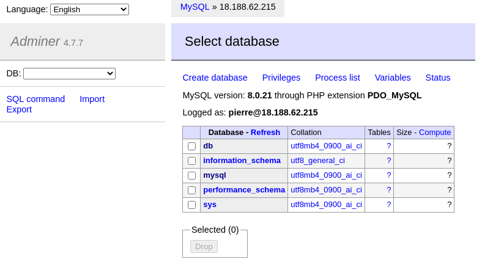

# How to export your database ?

## Step One : connect to the data base with adminer

in your browser go to http://IP_SERVER:8080

Be sure 'System' is on 'MySQL'

enter in 'Server' the ip of the server

enter in 'Username' your database user

enter in 'Password' your database password

you can enter in 'Database' the database you want to access

## Step Two : Go to export page

clique on Export at the left side of your screen.

## Step Three: select and export database

Select the Ouput as 'gzip'

Select the Format as 'SQL'

Select the database to export

Export

# How to import your database ?

## Step One : connect to the data base with adminer

in your browser go to http://IP_SERVER:8080

Be sure 'System' is on 'MySQL'

enter in 'Server' the ip of the server

enter in 'Username' your database user

enter in 'Password' your database password

you can enter in 'Database' the database you want to access

## Step Two : Go to import page

clique on import at the left side of your screen.

## Step Three: select file and import database

Select the file

Execute

