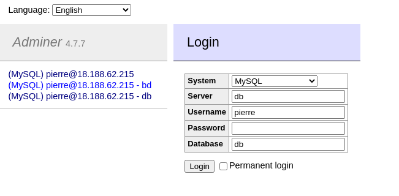

# How to connecte to the mySQL database ?

## to remote mySQL server with command line

### step 0 Port

Be sure you have open port 3306 of your server

### step 1 connect

    [pantoine@ordi-pierre credentials]$ mysql -u pierre -p -h ec2-54-215-214-63.us-west-1.compute.amazonaws.com
    Enter password: 
    Welcome to the MariaDB monitor.  Commands end with ; or \g.
    Your MySQL connection id is 122
    Server version: 8.0.21 MySQL Community Server - GPL

    Copyright (c) 2000, 2018, Oracle, MariaDB Corporation Ab and others.

    Type 'help;' or '\h' for help. Type '\c' to clear the current input statement.

    MySQL [(none)]>

## to remote mySQL server with adminer

### step 0 Port

Be sure you have open port 8080 of your server

### step 1 get to adminer

in your browser go to http://IP_SERVER:8080

Be sure 'System' is on 'MySQL'

enter in 'Server' the ip of the server

enter in 'Username' your database user

enter in 'Password' your database password

you can enter in 'Database' the database you want to access

