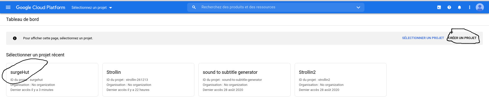
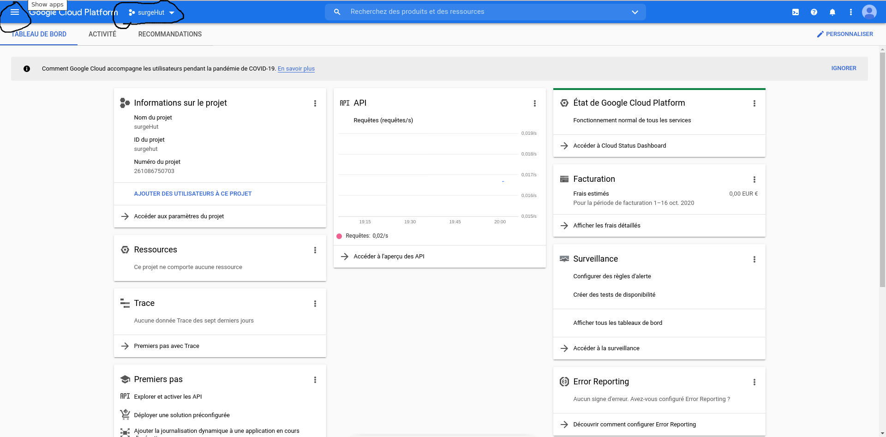
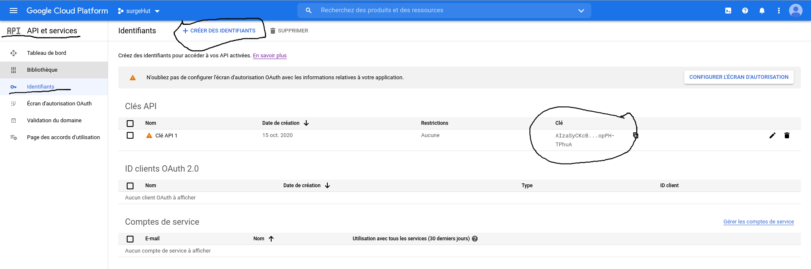
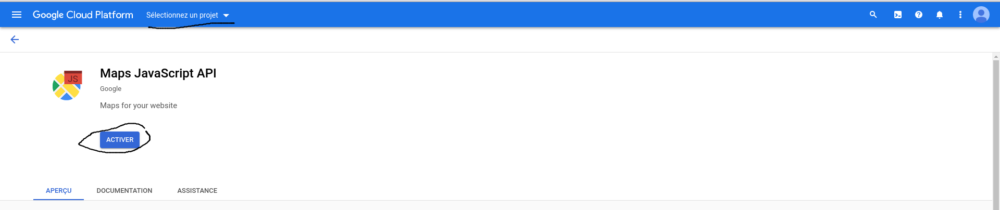

# How to use google map ?

## Step 0 get credential key

    get the key on the google console and create a project

https://console.cloud.google.com/projectselector2/home/dashboard

    Go to the APIs & Services > Credentials page.

    On the Credentials page, click Create credentials > API key.
    The API key created dialog displays your newly created API key.

    Click Close.
    The new API key is listed on the Credentials page under API keys.

## Step 1 activate google map

    activate Maps JavaScript API for the project

https://console.cloud.google.com/marketplace/product/google/maps-backend.googleapis.com?q=search&referrer=search

## Step 2 install google-map-react

https://www.npmjs.com/package/google-map-react

    npm install --save google-map-react

https://www.npmjs.com/package/react-geolocated

    npm install react-geolocated --save

## Step 3 use Map component

Use the component Map from '/application/docker/component/Map.js

you can change the value of 'bootstrapURLKeys' by the key generated in step 0
